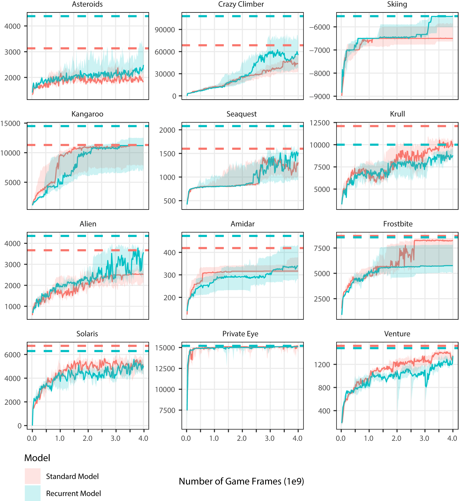

# Deep Neuroevolution Toolbox

Deep Neuroevolution Toolbox is a collection of code additions, changes and scripts for Uber AI's [Deep Neuroevolution](https://github.com/uber-research/deep-neuroevolution) and [Atari Zoo](https://github.com/uber-research/atari-model-zoo) to target personal academic research. 

## About

This software package applies patches to Deep Neuroevolution to allow flexible GPU and CPU allocation for cluster use.  The targeted cluster uses Scientific Linux 6.10 and Sun Grid Engine 6.2u5p3 as the scheduler. 

An additional environment has also been added, the [River Crossing Task](http://eprints.keele.ac.uk/30/1/Neuroevolution%20of%20agents%20capable%20of%20reactive%20and%20deliberative%20behaviours%20in%20novel%20and%20dynamic%20environments%20%28AChannon%29.pdf).

Atari Zoo has been adapted to work with frozen models from this Deep Neuroevolution implementation. The code is only targeting the generation of activation movies, and may not operate correctly with the additional features Atari Zoo provides.

Table of contents
=================

   * [Getting Started](#getting-started)
      * [Prerequisites](#prerequisites)
      * [Installation](#installation)
   * [Setting parameters](#setting-parameters)
      * [Allocate GPUs](#allocate-gpus)
      * [Allocate CPUs](#allocate-cpus)
   * [Using the Sun Grid Scheduler (SGE)](#using-the-sun-grid-scheduler-(sge))
      * [Overview](#overview)
      * [Setting runs](#setting-runs)
      * [Allocate CPU and GPU](#allocate-cpu-and-gpu)
      * [Choosing an environment](#choosing-an-environment)
      * [Using snapshots](#using-snapshots)
   * [Formatting atari output](#formatting-atari-output)
   * [Producing graph](#producing-graph)
   * [Freezing model](#freezing-model)
   * [Producing rollout](#producing-rollout)
   * [Producing activation movie](#producing-activation-movie)
   * [Notes](#notes)

## Getting Started

### Prerequisites

* [GPUtil](https://github.com/anderskm/gputil) : `pip install GPUtil`


### Installation


By typing `bash install.sh` at the project root, Deep Neuroevolution and Atari Zoo will be cloned, patches applied and new files copied to the required directories. 


The remaining installation process will be the same as laid out in [Deep Neuroevolution](https://github.com/uber-research/deep-neuroevolution/blob/master/gpu_implementation/README.md) and [Atari Zoo](https://github.com/uber-research/atari-model-zoo/blob/master/README.md) docs.

## Setting parameters

### Allocate GPUs

In `deep-neuroevolution/gpu_implementation/neuroevolution/tf_util.py` the method `get_available_gpus` finds unused GPUs on a node and allocates the amount specified by the parameter `numGPUs`. By default, this is `1`. Change value according to scheduler parameters.

### Allocate CPUs

In `deep-neuroevolution/gpu_implementation/gym_tensorflow/tf_env.h` the variable `const int threads` states how many CPU cores are used for the simulations. Change the value according to what was requested via the scheduler. This will require `gym_tensorflow.so` to be rebuilt. 

This is done with the commands below:

```bash
cd deep-neuroevolution/gpu_implementation/gym_tensorflow/
make clean
make
```

## Using the Sun Grid Scheduler (SGE)

This section provides all the details in using the provided SGE script with Deep Neuro. SGE scripts are run by the following command:

```bash
qsub scheduled_run.sge
```

### Overview

An SGE script is provided and can be found at `deep-neuroevolution/gpu_implementation/scheduled_run.sge`.

A configurable directory is created at  `deep-neuroevolution/gpu_implementation/`. Each simulation of an Atari game creates a subsequent subdirectory containing each evolutionary run. The `run-x` value is dictated by the SGE_TASK variable. 

Each evolutionary run folder contains the printout of the program and their snapshots. Below is a visual of this structure:

    ./
    ├── gpu_implementation
    │   └── runs
    │      ├── frostbite
    │      │   ├── run-0
    │      │   ├── run-1
    │      │   └── run-2
    │      ├── krull      
    │      │   └── run-0
    │      └── tennis      
    │          └── run-0
     
### Setting runs

This line below details how many runs a job produces.

```bash
#$ -t 1-1:1
```

This states the script will run a single job. If the code were to change to the following:

```bash
#$ -t 1-10:1
```

10 jobs would run, starting at iteration 1. The task numbers dictate the directory names.

### Allocate CPU and GPU

These values MUST match those that the code has been compiled to run, see earlier section for details. See the following:


```bash
#$ -pe gpu 4 # GPU Job using 4 CPU cores
#$ -l num_GTXany_per_task=1
```

This is requesting a GPU implementation (necessary for this code) along with 4 CPUs and 1 GPU. If you want 12 CPUs and 2 GPUS your code would look like the following:

```bash
#$ -pe gpu 12
#$ -l num_GTXany_per_task=2
```

### Choosing an environment

Parameters are needed for the script to locate the program and accompanying JSON file.

```bash
PROGRAM='ga.py'
PARAMETER='configurations/ga_atari_config.json'
DIRECTORY='runs'
```

It is important to understand these parameters if you wish to change this script in the future.

* `PROGRAM` - is a reference to the python file that runs Deep Neuro.
* `PARAMETER` - refers to the configuration file that loads the parameters for the simulations.
* `DIRECTORY` - is the name of the directory that will be created that holds the results for all the runs using this script.

### Using snapshots

Deep Neuro implements a snapshot feature. If there is a critical error or power outage, the latest snapshot is available to load in the population of GAs to continue the simulation. This is already written into the SGE script.

```bash
let SNAPSHOT_EVERY_TIMESTEP=1000000
let RUN_TO_TIMESTEP=1000000000
```

* `RUN_TO_TIMESTEP` - is how many frames the atari environments are running for.
* `SNAPSHOT_EVERY_TIMESTEP` - creates a snapshot at every frame iteration of this value. This also creates a directory for each block of runs. Keeping the snapshots at each iteration unaffected. 


## Formatting atari output

The text files in each game directory are a standard output stream of the programs output data. A python script is included to convert this to a CSV file.

Located at `deep-neuroevolution/gpu_implementation/formatting.py`, run the script via:

```bash
python formatting.py
```

Point `root_directory` to the directory which contains the folders of atari environments. The output CSV file/s will also be in this folder.

```bash
root_directory = "./runs/"
```

Included are bool parameters to turn on and off whether they are needed in the CSV output.

```bash
bool_PopulationEpRewMax                = 1
bool_PopulationEpRewMean               = 1
##### 
#####
bool_TimeElapsed                       = 1
bool_TimeElapsedTotal                  = 1
```


## Producing graph

An R script (`deepneuro_linegraph.R`) is provided to convert the CSV to a graph. The parameters below are those which require changing.

```r
dir <- ".."
title = "games"
listOfGames <- c("private_eye","krull","crazy_climber","alien")
listOfModels <- c("LargeModel", "RecurrentLargeModel")
columnsPerGraph = 4
numOfRows = 5
```

* `dir` - location of the CSV output file/s.
* `title` - plots title.
* `listOfGames` - a list of games to plot. These names must match the CSV file/s name.
* `listOfModels` - a list of models to plot on each sub-plot.
* `columnsPerGraph ` - the number of columns.
* `numOfRows` - the number of rows.

Note: The script is written for 4 billion frames on the x-axis.

Example of the plot can be seen below:




## Freezing model

For future automation (to-do), seeds of the models are saved to text files. These seeds are then used to freeze the model. To comply with the established Atari Zoo local dir, files are stored at `~/space/rlzoo/`. So GA for Alien would be stored `~/space/rlzoo/ga/AlienNoFrameskip-v4/`.

Below is how seeds appear:

```python
seeds = (148462608, (219531121, 0.002), (172882699, 0.002))
```

Seeds can be found in the output text files from Atari runs. They should be saved in the appropriate file dir and named like the following: `GAME`_`MODEL` `RUN`.txt.

```bash
alien_model1_final.txt
```

Models are saved using the `save_model.py` script located at `deep-neuroevolution-RC/gpu_implementation`. The script requires three command-line parameters:

* `game` - human-readable text of game that the model was trained on.
* `model` - the learning method used to train (e.g. GA, ES, A2C).
* `run` - the numerical value of the run.

An example of this is shown below:

```bash
python save_model.py alien ga 1
```

This will save the model to `~/space/rlzoo/ga/AlienNoFrameskip-v4/model1_final.pb`.

## Producing rollout

This produces an npz compressed file of observations of the environment at each frame. This can be used with Atari Zoo to create an activation movie. 

The file `rollout.py` is found in `atari-model-zoo/` and requires a dir location to `gym_tensorflow.so` to operate. Apply the dir here:

```python
# enter the dir for the gym_tensorflow.so for 'import gym_tensorflow'
sys.path.append('...')
```

Once done, the rollout is similar to freezing the model. The three parameters are required again:

```bash
python rollout.py alien ga 1
```

And the location is the same as the frozen model.

```bash
~/space/rlzoo/ga/AlienNoFrameskip-v4/model1_final_rollout.npz
```

## Producing activation movie

Both `save_model.py` and `rollout.py` place the frozen model and rollout file in the correct location for Atari Zoo to create an activation movie. 

Locate the file `generate_video.py` in `atari-model-zoo/` and change the following lines accordingly:

```python
algo = 'ga'
env = "AlienNoFrameskip-v4" 
run_id = 1
```

These should mimic those used in `save_model.py` and `rollout.py`. Then run the script by:

```bash
python generate_video.py
```

## Notes

The way in which models are frozen in this codebase is not standard with the default Atari Zoo codebase. Therefore, not all of Atari Zoo's features are available. If your goal is to use other Atari Zoo features, that is not generating an activation video, then a more well-rounded system for freezing the model should be pursued. 

The changes to Deep Neuro suit an environment in which there are shared resources, the default implementation is better suited if virtualization is available.

This repo is purely for personal academic research and has been tailored to that. This codebase may offer ideas, but I would recommend using the original code and adapting it to your specific scenario. 